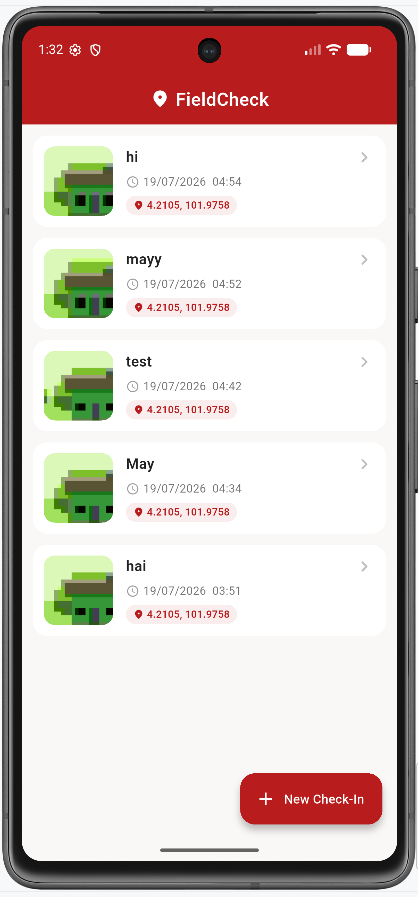
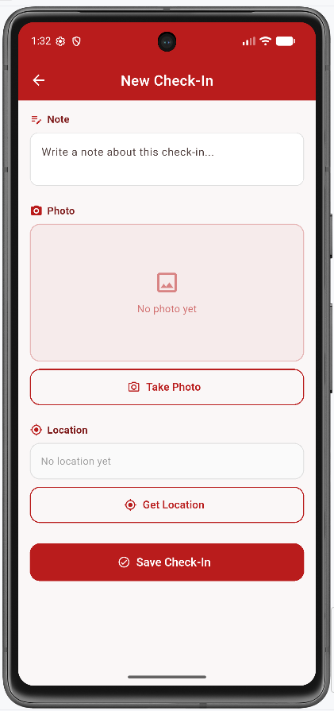
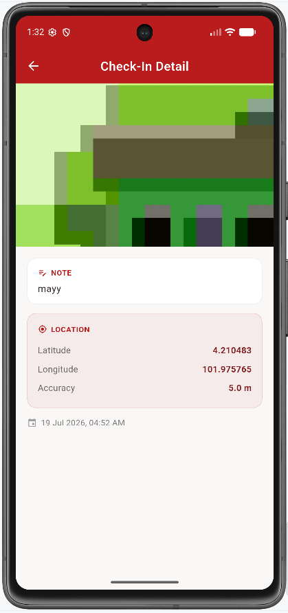

# FieldCheck — Field Check-In App

A Flutter app to check in at a location: take a photo, record GPS coordinates, and save the record locally so it appears in a history list and survives an app restart.

---

## How to Run the App

### Prerequisites
- [Flutter SDK](https://flutter.dev) installed and added to PATH
- Android Studio (for Android SDK + emulator) or a physical Android device with USB debugging enabled
- VS Code with the Flutter and Dart extensions (or Android Studio)

### Steps
1. Clone this repository
   ```
   git clone https://github.com/apatsrapromdee-a11y/fieldcheck.git
   cd fieldcheck
   ```
2. Install dependencies
   ```
   flutter pub get
   ```
3. Connect a device or start an emulator
   ```
   flutter devices
   ```
4. Run the app
   ```
   flutter run
   ```

---

## Plugins Used

| Plugin | Purpose |
|---|---|
| `image_picker` | Take a photo using the device camera |
| `geolocator` | Get current GPS latitude, longitude, and accuracy |
| `permission_handler` | Handle runtime permission requests |
| `shared_preferences` | Persist check-in records locally so they survive an app restart |
| `intl` | Format saved timestamps for display |
| `path_provider` | (included for potential future file-path handling) |
| `cupertino_icons` | Default Flutter icon set |

---

## Screenshots


| Home / History | New Check-In | Check-In Detail |
|---|---|---|
|  |  |  |

A short demo video is available here: https://github.com/user-attachments/assets/b1638646-610b-42e7-8882-9d2effc8712f
---

## Requirements Checklist

### 1. UI Layouts
- [x] Three screens: Home / History, New Check-In, and Detail, with navigation between them
- [x] Home shows a list of saved check-ins (thumbnail + note + timestamp)
- [x] Empty state shown when there is no data
- [x] New Check-In has a note field with validation
- [x] Take Photo button with preview
- [x] Get Location button showing latitude / longitude / accuracy, with a loading state
- [x] Save button
- [x] Detail screen shows one record, read-only
- [x] UI split into reusable components (`CheckInCard`, section widgets, etc.) instead of one large `build()`

### 2. Hardware Integration
- [x] Camera — take a photo and show a preview (`image_picker`)
- [x] GPS — get current latitude, longitude, and accuracy (`geolocator`)
- [x] Local Storage — check-ins persist and survive an app restart (`shared_preferences`)
- [x] Camera and Location permissions requested at runtime
- [x] App does not crash when a permission is denied — shows an inline error message instead
- [x] GPS request has a timeout, so the app does not hang/ANR if no location fix is available

### Known limitations / not done
- [ ] Editing or deleting an existing check-in is not implemented (only create + view)
- [ ] Not tested on a physical iOS device (developed and tested on Android emulator/device only)
- [ ] `GpsCard` and `PhotoCard` widgets exist in `lib/widgets/` but are not currently wired into the New Check-In screen (the screen uses its own internal `_LocationSection` / `_PhotoSection` widgets instead) — kept for potential future reuse

---

## Project Structure

```
lib/
├── main.dart
├── models/
│   └── checkin.dart
├── screens/
│   ├── home_screen.dart
│   ├── new_checkin_screen.dart
│   └── detail_screen.dart
├── services/
│   ├── location_service.dart
│   └── storage_service.dart
└── widgets/
    ├── checkin_card.dart
    ├── gps_card.dart
    └── photo_card.dart
```


